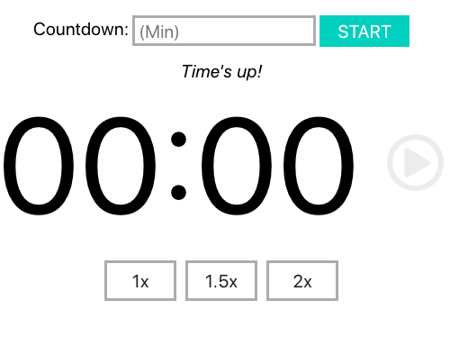
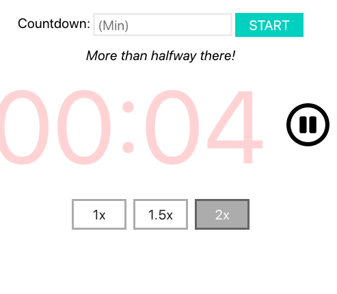
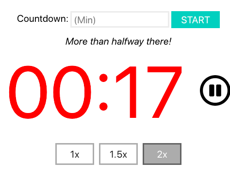
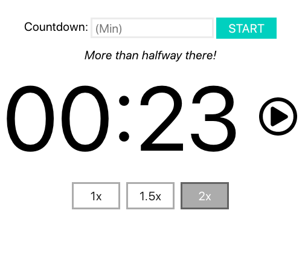
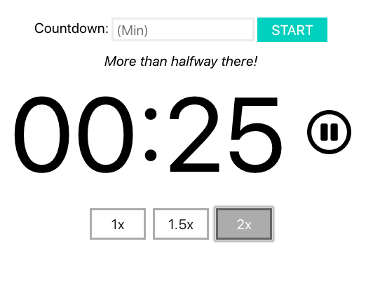
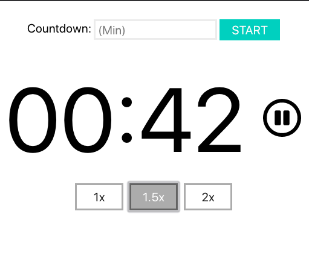
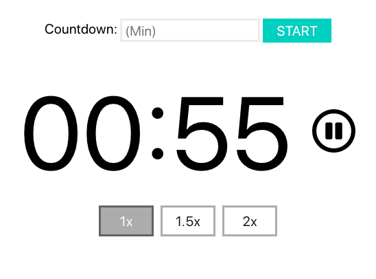

# Countdown Time Application

## Features

This is simple app that let you configure a timer, with the following features:

- The user must to enter a positive integer in order to initialize the countdown.

- The time display format is MM:SS.

- The user can pause and resume the countdown.

- When the contdown is active, the user can speed up or slow down by 1x, 1.5x, or 2x.

- Once the countdown is at 50%, the application will tell you with a label: “More than halfway there!”

- Once the countdown is 0, that label stated above will change to: “Time’s up!” (and make some sound :D).

- When the countdown hits 20 seconds left, the time displayed should be red.

- At 10 seconds, the timer text should blink.

## Development

The scaffold was created using `create-react-app`, and the package manager is yarn.

The app structure is pretty simple:
- `src`: Contains all the source code, components, and tests styles.
- `public`: Contains the static resources.
- `build`: This folder will be generated when you run `yarn build` or `yarn deploy`

## Deployment

As `gh-pages` hosts the application, you only need access to the repository and type `yarn deploy` to deploy.

## Screenshots

## Walkthrough video

